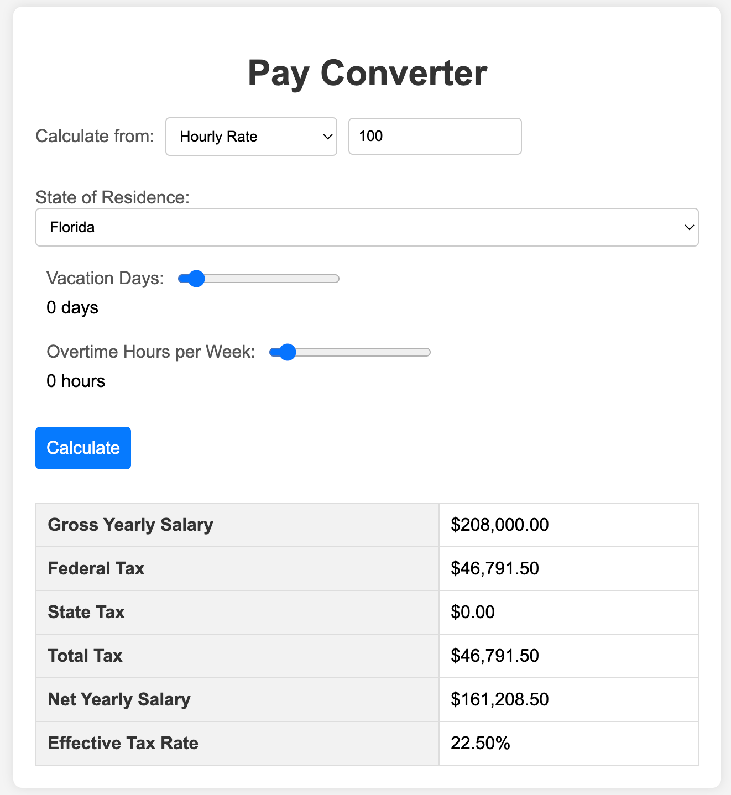

# gptapps
The apps were all created using generative pretrained transformers

Other tools used:
- https://sourcegraph.com/cody
- https://github.com/features/copilot
- https://code.visualstudio.com/download
- https://gchq.github.io/CyberChef/

## loancalc 

This is the recipe that I used to create the loan calculator, it is a simple web application that allows the user to input a loan amount, interest rate, and loan term and then calculates the monthly payment. I started with a simple prompt and then used the chatgpt api to generate the code. In this case I used sourcegraph's cody inside of vscode see https://marketplace.visualstudio.com/items?itemName=sourcegraph.cody-ai and started with this prompt:

> Create a web application that is a loan calculator. Make the months and interest rates adjustable in a slider.Allow the user to input total loan amount and calculate monthly payment. Add a total cost of the loan and a line with the total interest. Add commas to the numeric formattings on output. Add can we add a button to generate an amortization table and make sure we can render the full amortization Table. Make the width of the previous and next buttons much smaller and add a first and last button.

And simple tweeks from there gets the job done.

### tipcalc

Given a successful loan calculator, I used the same methodology to create tip calculator. 

> Create a web application that is a tip calculator. have preset tip amounts at $5, $10, $20 or add 15%, 18%, 20% of the bill. Add a slider to allow for the number of people to split the bill.

### paycalc

This is a simple web application that converts an hourly pay rate to a yearly equivalent. It includes options for number of vacation days, overtime, and after tax calculation. It also includes sliders for adjustable values and format the output with proper currency formatting. It also works both ways.

>Create a web application that converts an hourly pay rate to a yearly equivalent. Include options for number of vacation days overtime and after tax calculation. Add sliders for adjustable values and format the output with proper currency formatting. Make sure it works both ways.

